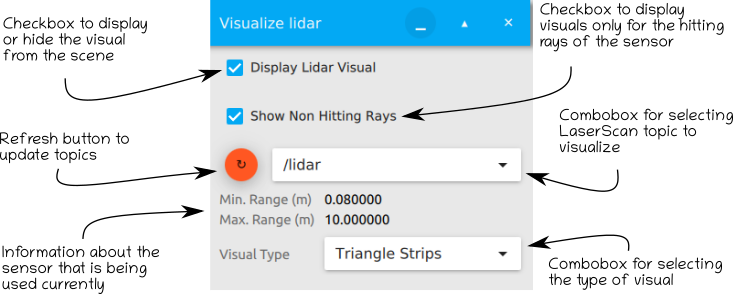

# Google Summer of Code 2020: Sensor Data Visualization

>**Organization:** Open Source Robotics Foundation 
**Mentors:** Ian Chen (@iche033), Alejandro Hernández Cordero (@ahcorde)
**Student:** Mihir Kulkarni ([mihirk284@gmail.com](mailto:mihirk284@gmail.com))
**Link to GSoC project:** https://summerofcode.withgoogle.com/projects/#4954547925024768

Hello dear roboticists,

This summer I was selected to work on Sensor Data Visualization for the [ignition-rendering](https://github.com/ignitionrobotics/ign-rendering/issues) library. This project is a part of a larger [Ignition](https://ignitionrobotics.org) simulation framework, aiming to provide a new simulation platform for roboticists. This new simulation framework contains improvements and a redesign of the backbone of the simulation framework that exists in [Gazebo]((http://gazebosim.org)). It supports distributed simulation, dynamic asset loading, and tunable performance. It also provides cross-platform support on Linux, macOS, and Windows, making simulation more accessible.

During the GSoC program, I worked directly on the ignition-rendering library to add sensor data visualization under the guidance of @iche033 and @ahcorde. I am grateful to Open Robotics for providing me this opportunity. This summer has been a very enriching experience.

## About the project

The project Sensor Data Visualization involves adding a new type of sensor visual to the ign-rendering library. This visual is used to render data collected from a simulated lidar sensor. It extends the capabilities of the LaserVisual present in Gazebo and adds new features to it. Implementation of the visual is present in both Ogre1 and Ogre2

A new feature is added to the visual where the user can select whether they want to see only the rays hitting a particular obstacle. This means that the user can visually see the relevant information of the environment, as perceived by the robot, and avoid the clutter caused by visualization of the lidar data that is of no use to the robot. This has been done as it is difficult for the user to make sense of the data when the sensor rays are displayed too close to each other.

Apart from the original Triangle-Strips, new visual types are added that include Ray-Lines and Points. These have been added with the intention that the user will be able to choose the kind of visual that they want to see based on the application. The addition of Points adds the ability to visualise the points inside the simulation as well. Ray-Lines and Points are relatively faster to render and update than the Triangle-Strips visual type.

Additionally, a new material has been created in the form of a flat-square facing the user. This has been implemented in Ogre1 and the Ogre2 implementation is underway. This meterial is used to represent points and the user can set the independent colours for each point using the API. It is identical to the flat-square visual type of the PointCloud visual in RViz.

The developed visual was integrated with ign-gazebo as a loadable GUI plugin. The user can select the sensor message to display from and set the properties of the visual through the GUI. The following image shows a brief guide on the plugin.

  

## Demos

## Conclusion and Future plans

During the project I was able to satisfy most of the goals, however stretch goals like addition of PointCloud to the rendering library is remaining.

I would really appreciate feedback from the community to improve the features, address bugs, or implement new features that would make it easy for the users to use the plugins or the library.

I plan to continue contributing to ROS packages and Ignition libraries. I thank my mentors @iche033 and @ahcorde for their constant support and guidance. GSoC'2020 has been a great experience and I look forward to working with my mentors and Open Robotics in future projects.

## About Me

I am an incoming Ph.D. student into the Computer Science program at the University Of Nevada, Reno. I graduated from Birla Institute of Technology and Science (BITS) Pilani, India in 2020, with a degree in Mechanical Engineering.

I completed my Bachelor's Thesis at the [Autonomous Robots Lab](https://www.autonomousrobotslab.com/), University of Nevada, Reno, where I worked on the motion planning for a reconfigurable aerial robotic system. My results were implemented using ROS and Gazebo and have now been published in a major conference. Through the lab, I am also a part of Team CERBERUS, participating in the [DARPA Subterranean Challenge](https://www.subtchallenge.com/), focusing on autonomous search and rescue missions in constrained undergraound environments.

I have been involved in robotics related projects for over three years, as a part of student clubs in my university. I have learned a lot during this time, and ROS and Gazebo have played a significant role during the journey. I hope to keep contributing to this wonderful community of innovators.

Thanks,
Mihir Kulkarni