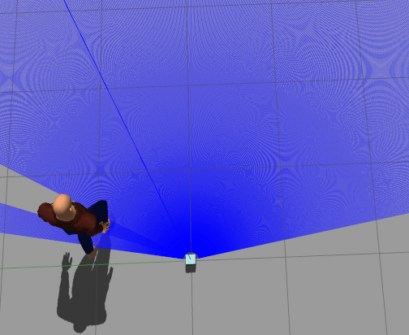
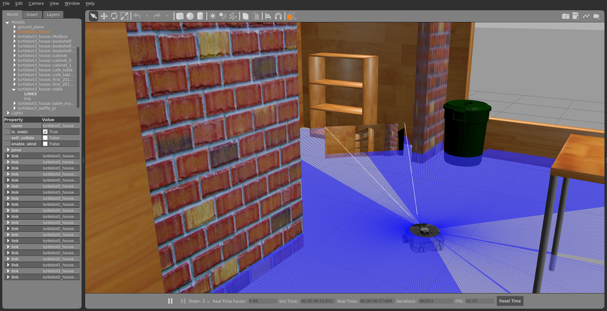
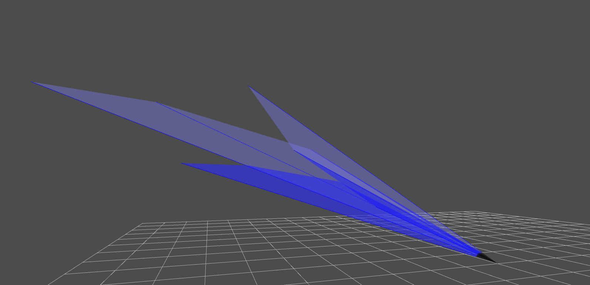
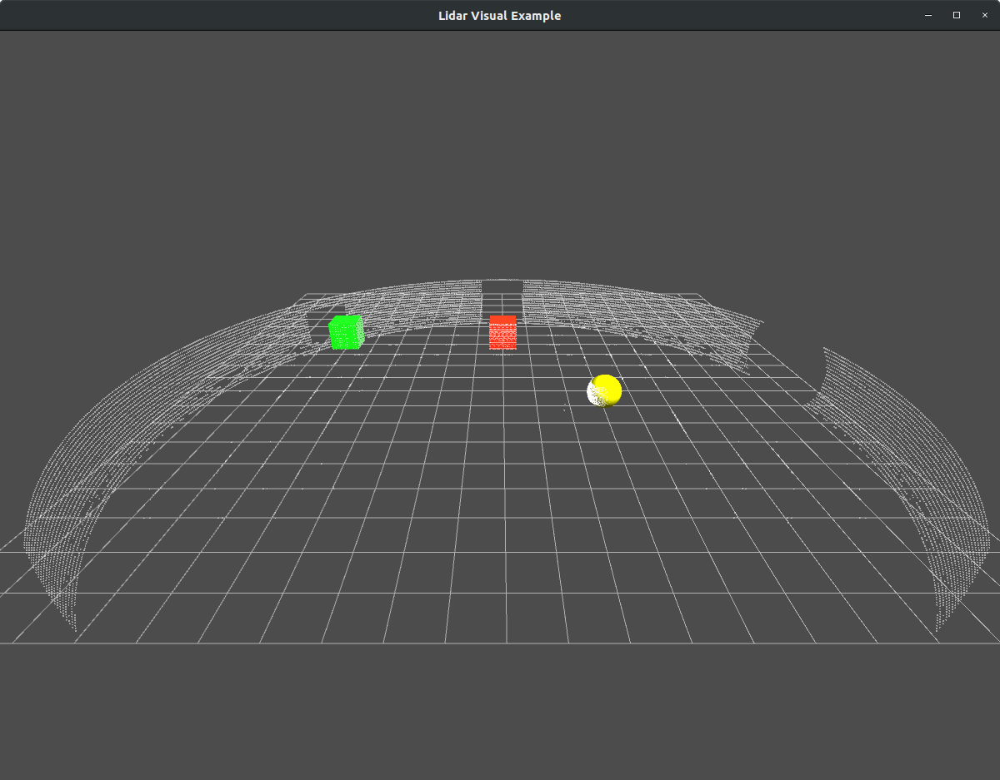
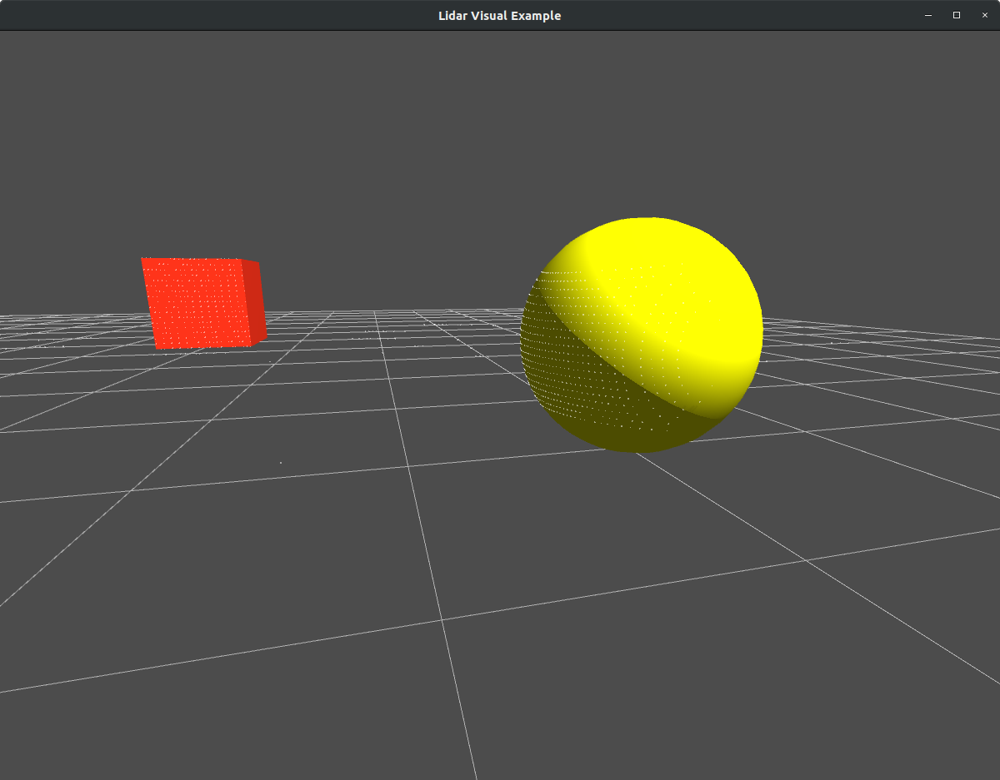
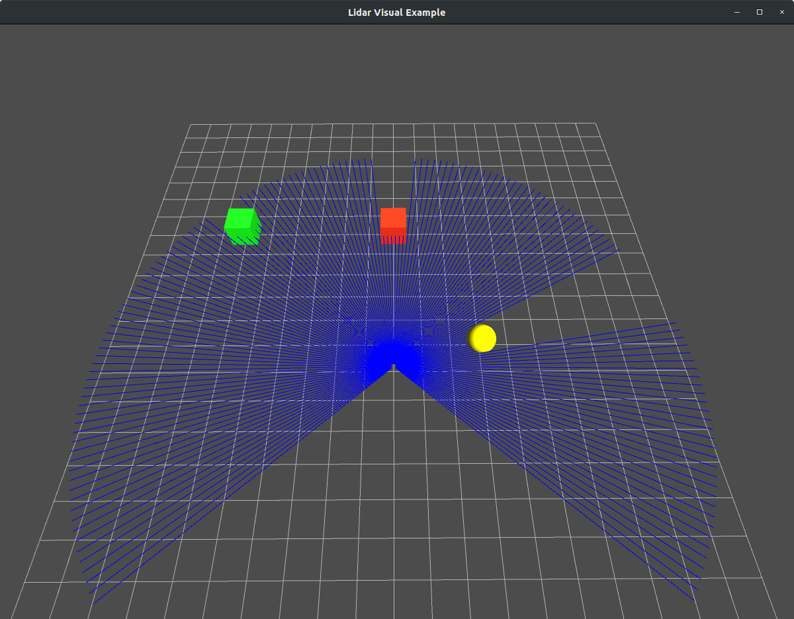
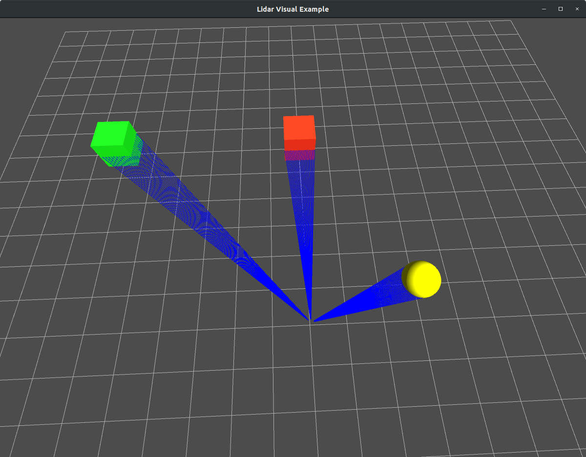
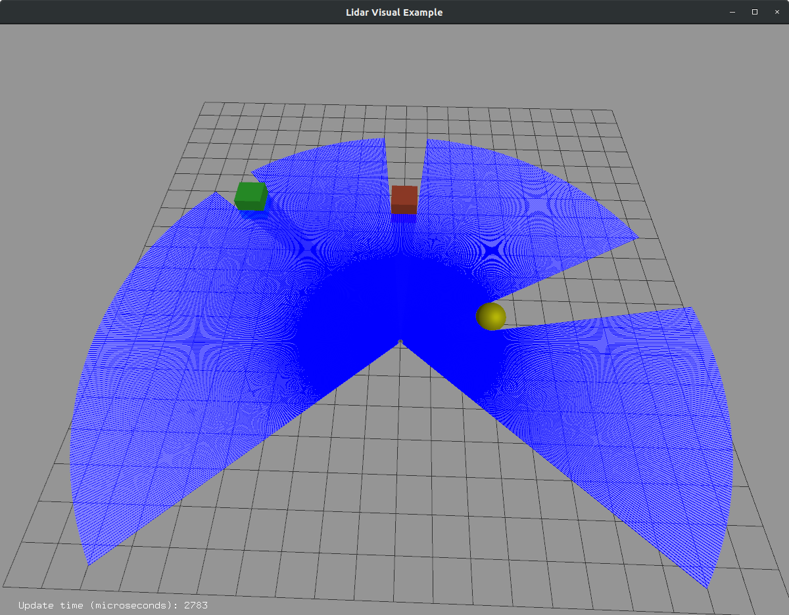
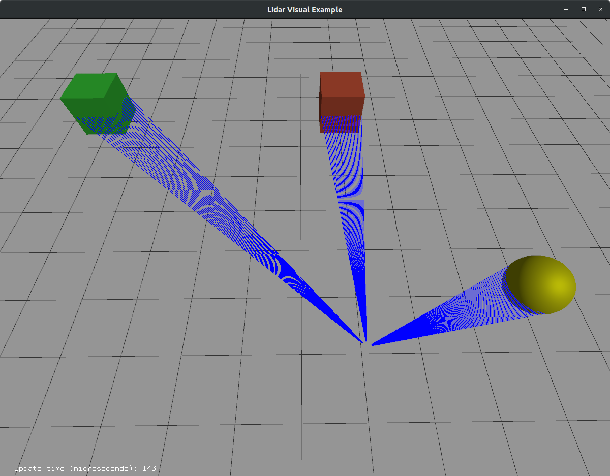

# Work Product Submission for GSoC 2020

This document contains details of the work done and the code contributions made as a part of the GSoC 2020 program.

TL;DR All the code contributions and Pull Requests can be found [here](#Code-Contributions-during-GSoC).

## Project - Sensor Data Visualisation ([Open Robotics](https://www.openrobotics.org/))

### Mentors - Ian Chen, Alejandro Hernández Cordero.

This project is a part of a larger [Ignition](https://ignitionrobotics.org) simulation framework, which aims to provide a new simulation platform for roboticists. This project is a successor of the [Gazebo Simulator](http://gazebosim.org). This new simulation framework contains improvements and a redesign of the backbone of the simulation framework that exists in Gazebo. It supports distributed simulation, dynamic asset loading, and tunable performance. It also provides cross-platform support on Linux, macOS, and Windows, hence making simulation more accessible to all.

The simulation is being made more realistic, making use of advanced 3D graphics software Ogre 2.1. The implementation of graphics is done through the [Ignition Rendering](https://ignitionrobotics.org/libs/rendering) library, which provides access to the latest rendering techniques and a faster rendering pipeline.

During my GSoC, I worked directly on the ignition-rendering library to add sensor data visualization.

## Task
The task of the project is to create visualizations for lidar data in the ignition-rendering library and to load it as an interactive plugin in the simulation environment.

[This issue](https://github.com/ignitionrobotics/ign-rendering/issues/84) created by my mentor highlights my tasks for the GSoC.

>Create visualizations for lidar data. This can be divided into smaller subtasks:
>* Design public APIs for a lidar visualization class, e.g., LidarVisual. The abstract interface will go in ign-rendering/include/ignition/rendering/ and a base implementation will live in ign-rendering/include/ignition/rendering/base
>* Port the LaserVisual class from Gazebo to ign-rendering/ogre. This would be the ogre 1.x implementation. Note that in Gazebo's [LaserVisual](https://github.com/osrf/gazebo/blob/gazebo11/gazebo/rendering/LaserVisual.cc) class, the data come from ign-transport. However, since ign-rendering does not use ign-transport, we should design the APIs in 1. to support accepting and modifying lidar data, e.g., either an API that takes a vector of floating-point values or individual values. We will call these APIs from ign-gazebo to feed it the lidar data to be visualized.
>* Add ogre 2.x implementation

## Reference

This work was a part of the Gazebosim project. It was implemented in Gazebo as a visual and widely used within the robotics community. This work was to be ported to ign-rendering and made compatible with the new rendering framework, compatible with both Ogre1 and Ogre2.

<!-- {:height="36px" width="36px"} -->

 

The implementation of the LaserVisual in Gazebo-Classic can be found [here](https://github.com/osrf/gazebo/blob/gazebo11/gazebo/rendering/LaserVisual.cc)

<!--  -->

---

## Work done during GSoC

The initial part of the work involved going through the code in the gazebo repository. Since this was my first introduction to any rendering engine, it took some time to understand how the engine, scene, visuals, geometries, and nodes are linked to one another and what purpose they serve in the rendering pipeline.

Initially, it was confusing, but searching through the repository for examples and various implementations allowed me to get a good idea of the same. Since Gazebo classic's implementation is almost identical to the Ogre1 implementation in ign-rendering, it was easy to port a similar code to ign-rendering and test it. By the end of my first month of GSoC, I put together a basic example of the lidar visual. I opened a Pull Request to the ign-gazebo repository. You can view my Pull Request here :- [Added LidarVisual implementation for Ogre1, empty classes for Ogre2 #103](https://github.com/ignitionrobotics/ign-rendering/pull/103)

During this submission, I found out the importance of writing maintainable code. My mentors pointed out possible improvements to readability and optimizations for faster operation. My code was tested on the organization's [build farm](https://build.osrfoundation.org/) on different operating systems to ensure that the code compiles and is free of errors. This process is undoubtedly necessary. It is not always possible for me to test the same code on multiple operating systems locally due to hardware constraints.

The image above shows an initial LidarVisual in ign-rendering with dummy sensor data.

I noticed that the entire field-of-view of the sensor was being shown by the visual using blue colored strips in the previous implementation. This has been implemented in numerous robots in Gazebo. For robots that had very dense rays from the sensors, this caused significant difficulty for the user to visualize the relevant rays from the lidar sensor, which were only slightly darker.

A new feature was added to the visual where the user can select whether they want to see only the rays hitting a particular obstacle. This means that the programmer or the developer can visually see the lidar sensor's relevant features and avoid the clutter caused by the lidar data that is of no use to the robot. This would significantly help in debugging the robot's behavior if the developer can see what the robot sees instead of having to deal with raw numbers.

Another addition made was providing the user an option to visualize the sensor data as either ray lines or points. This addition helped avoid the clutter caused due to large blue triangles on the screen. It made it easier to customize the visual as per the user's preferences.

This feature was submitted as a part of this Pull Request:- [Add types for lidar visual #114](https://github.com/ignitionrobotics/ign-rendering/pull/114)

 

In the above image, the sensor data can be seen visualized as points. This is similar to how a point cloud is also seen during simulations. This will form a basis for creating the point cloud visualization class later. 

 

The above image shows the visual as ray lines. This is significantly faster to render and less cluttered than the triangle strips visual shown above.

---

Post the implementation of the visual in Ogre1. The task was to implement the same in [Ogre2](http://wiki.ogre3d.org/Ogre+2.1+FAQ). It boasts of improved performance, a faster scene manager, in addition to more realistic rendering. Some performance metrics between Ogre1 & Ogre2 can be seen [here](https://github.com/OGRECave/ogre/issues/662).

An addition to the API was made to allow the user to clear all the visual data at will.

This Pull Request adds LidarVisual implementation to Ogre2:- [Ogre2 Implementation for Lidar Visual #116](https://github.com/ignitionrobotics/ign-rendering/pull/116/files)

 

The visuals have been implemented in Ogre2, as shown above.

---

Once the points were implemented, it was noticed that the size of the points showing the lidar data reading remains constant. On zooming into the scene, the point size does not change despite the size of all other objects in the scene changing as per the camera's location in the scene. This caused difficulties in viewing the points. 

Additionally, the points rendered by in the scene did not show independent color. This was an issue as coloring the points gives the user more information about the location, intensity, or reflectivity of the obstacle, as seen by the sensor. This coloring of points is necessary for many robotic applications. The below images shows the importance of point coloring in robotic applications.

   

The point colors help rudimentarily segment the part of the environment.

We created a material that is displayed as a flat square facing the user's camera to add this capability. This material allows the user to change the color or every point and hence make use of this feature when the point cloud is being implemented.

The Pull Request can be seen here:- [Add LidarVisual point colors for Ogre1 #124](https://github.com/ignitionrobotics/ign-rendering/pull/124)

---

After this implementation was done, it was time to integrate the LidarVisual from the ign-rendering library into the ign-gazebo simulator. An interface had to be created using the Qt framework. The following options are provided to the user.

TODO

---

# Code Contributions during GSoC

## Feature Additions

[Added LidarVisual implementation for Ogre1, empty classes for Ogre2 #103](https://github.com/ignitionrobotics/ign-rendering/pull/103)

[Add types for lidar visual #114](https://github.com/ignitionrobotics/ign-rendering/pull/114)

[Ogre2 Implementation for Lidar Visual #116](https://github.com/ignitionrobotics/ign-rendering/pull/116/files)

[Add LidarVisual point colors for Ogre1 #124](https://github.com/ignitionrobotics/ign-rendering/pull/124)

[Visualize Lidar Plugin for ign-gazebo #301](https://github.com/ignitionrobotics/ign-gazebo/pull/301)

## Bug Fixes, Minor Changes

[minor change in LidarVisual for the case when sensor data is more than sensor range #132](https://github.com/ignitionrobotics/ign-rendering/pull/132)

[FIX failing lidar visual integration test #121](https://github.com/ignitionrobotics/ign-rendering/pull/121)

### Other contributions to Open Robotics outside the purview of GSoC

[DARPA SubT Team Cerberus Robot Model - Gagarin](https://github.com/osrf/subt/pull/518)