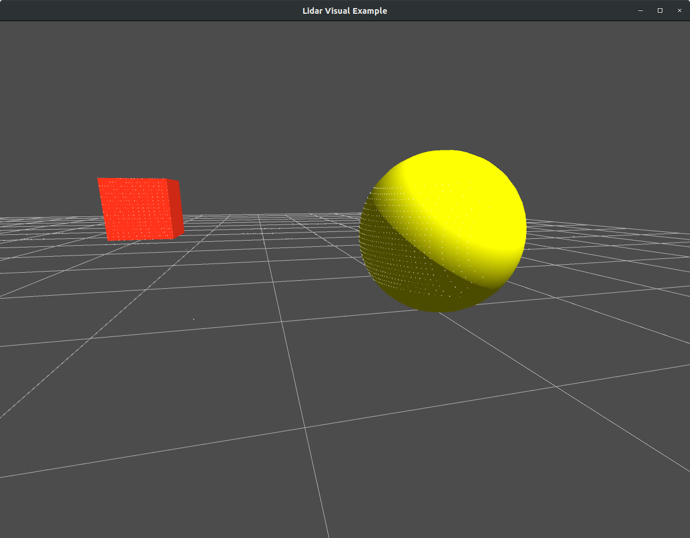
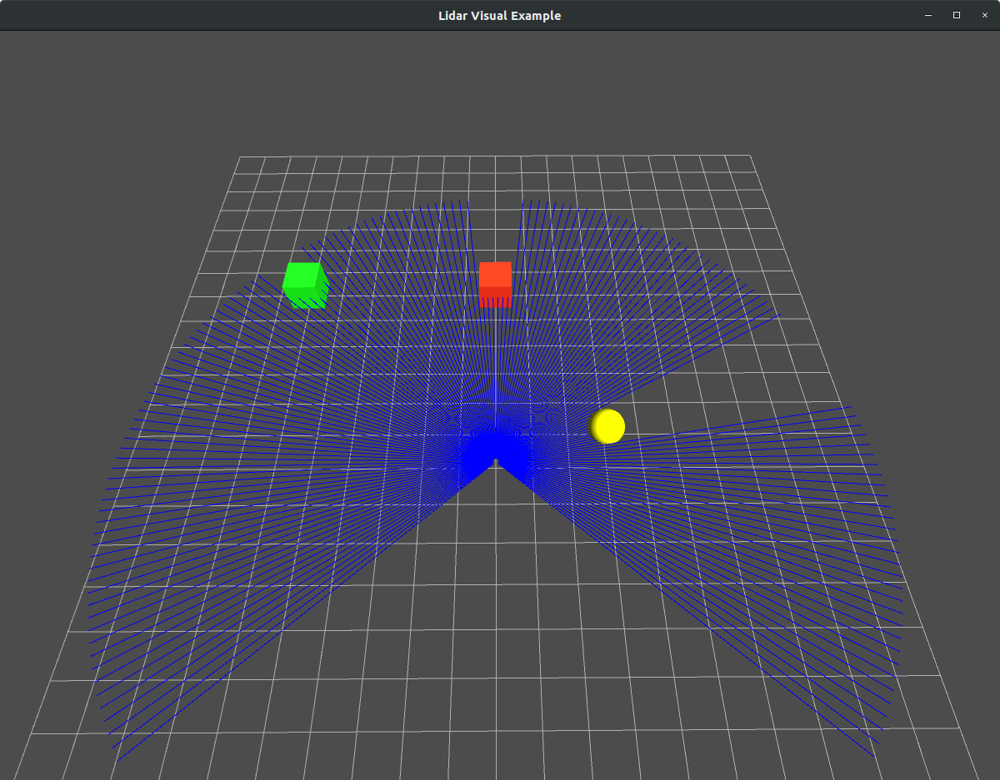
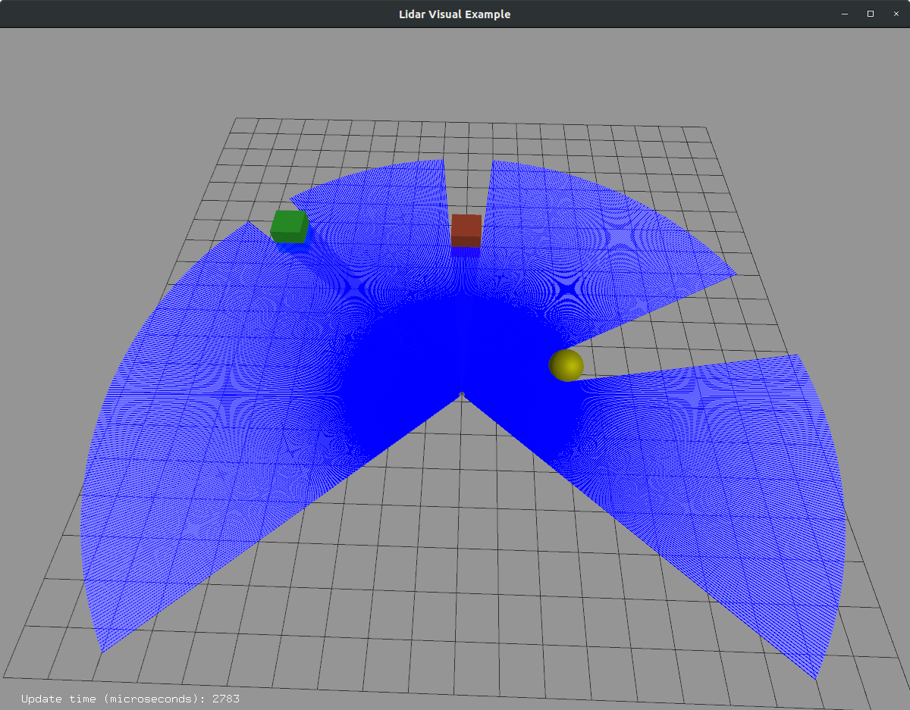
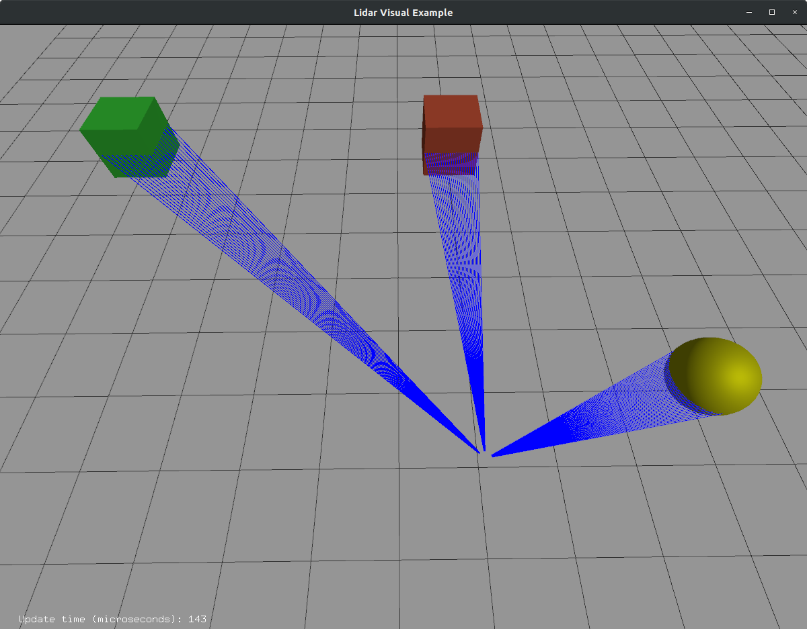

# About Me

I am an incoming student into the Ph.D. in Computer Science program at the University Of Nevada, Reno. I graduated from Birla Institute of Technology and Science (BITS) Pilani, India in 2020, with a degree in Mechanical Engineering.

 I have been involved in robotics-related projects for over three years. I have learned a lot during this time, and ROS and Gazebo have played a significant role during the journey.

I completed my Bachelor's Thesis at the Autonomous Robots Lab, University of Nevada, Reno, where I worked on the motion planning for a reconfigurable aerial robotic system. My results were implemented using ROS and Gazebo and have now been published in a major conference. Through the lab, I am also a part of Team CERBERUS, participating in the DARPA Subterranean Challenge, focusing on autonomous search and rescue missions.

During the GSoC program, I worked on porting the lidar visualization from Gazebo to the ign-rendering library and creating a GUI plugin for the user to control it. This plugin adds to the visualization capabilities of the IgnitionRobotics project. It allows the user to better understand the sensor data through customizable visuals.

---

# Project - Sensor Data Visualisation ([Open Robotics](https://www.openrobotics.org/))

## Mentors - Ian Chen, Alejandro Hernández Cordero.

This project is a part of a larger [Ignition](https://ignitionrobotics.org) simulation framework, aiming to provide a new simulation platform for roboticists. This new simulation framework contains improvements and a redesign of the backbone of the simulation framework that exists in [Gazebo]((http://gazebosim.org)). It supports distributed simulation, dynamic asset loading, and tunable performance. It also provides cross-platform support on Linux, macOS, and Windows, making simulation more accessible.

The simulation is being made more realistic, making use of advanced 3D graphics software Ogre 2.1. The implementation of graphics is done through the [Ignition Rendering](https://ignitionrobotics.org/libs/rendering) library, which provides access to the latest rendering techniques, and a faster rendering pipeline.

During my GSoC, I worked directly on the ignition-rendering library to add sensor data visualization.

## Task
The project's task is to create visualizations for lidar data in the ignition-rendering library and load it as an interactive plugin in the simulation environment.

## Work done during GSoC

The project involved adding a new type of sensor visual to the ign-rendering library. This visual is used to render data collected from a simulated lidar sensor. It extends the capabilities of the LaserVisual present in Gazebo and adds new features to it. Implementation of the visual is present in both Ogre1 and Ogre2.

A new feature is added to the visual where the user can select whether they want to see only the rays hitting a particular obstacle. This means that the user can visually see the relevant information of the environment, as percieved by the robot, and avoid the clutter caused by visualisation of the lidar data that is of no use to the robot. This has been done as it is difficult for the user to make sense of the data when the sensor rays are too close to each other.

In addition to triangle strips, the user is provided options to visualize the sensor data as rays or points. This allows the user to choose the kind of visual they want based on their application and also makes rendering faster.

A material is created and rendered as a flat square facing the user. This material is used for representing points, with each flat square capable of displaying an independent colour. It is identical to the way a pointcloud is displayed.

 

In the above image, the sensor data can be seen visualized as points.

 

The images above show the example of a lidar sensor, rendered using Ogre1.

 

The images above show the example of the lidar sensor in a similar environment, rendering using Ogre2.

The integration of LidarVisual into the ign-gazebo simulator is done in the form of a GUI plugin. An interface has been created using the Qt framework. The following shows a brief guide on the plugin:-

This plugin is used to control the properties of the visual in the simulation. An example world is created, which consists of a [Playground Model](https://app.ignitionrobotics.org/OpenRobotics/fuel/models/Playground) from the [Ignition Fuel Server](https://app.ignitionrobotics.org/dashboard).

The environment also contains a stationary lidar sensor, and a lidar mounted on a mobile base modeled after the Hokuyo lidar sensor referenced from Gazebo. This mobile base is a diff-drive platform used for the validation of various applications in ign-gazebo.
For the second sensor, the noise has been added to approximate real-world behavior.

The following example shows how the visual is seen when the stationary sensor's data is read and visualized as points.

The option to visualize the points hitting the obstacles helps the user better make sense of the lidar data.

In the following media attachment, an example is shown where the sensor data from the mobile robot is read and visualized. Here, the different visuals are seen.

Finally, a practical application of the robot moving is shown below. In this application, the visual must be consistent and update correctly when the robot is in motion.

